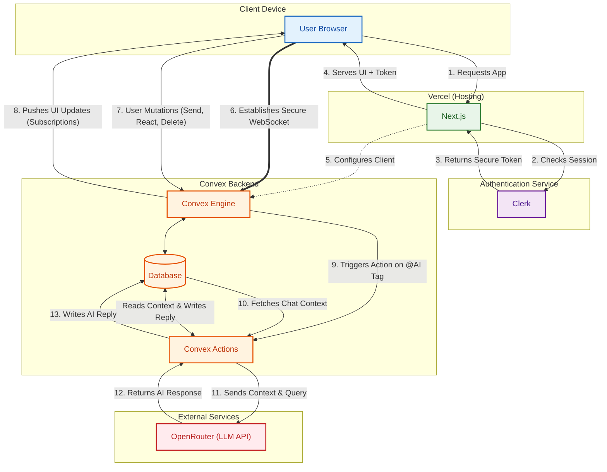

# LiveCaller

A modern, full-stack real-time messaging application built with Next.js, Convex, and Clerk. LiveCaller provides instant 1-on-1 communication with a native-app feel.

**Live Demo:** [https://live-caller.vercel.app](https://live-caller.vercel.app)

### Key Features

* **Secure, Real-Time Foundation:** Complete user authentication and session protection via Clerk, paired with instant, bidirectional message delivery powered by Convex WebSockets.

* **Privacy-First AI Agent:** A context-aware AI for group chat summaries and Q&A, secured by strict routing gates that completely isolate the bot from user directories and private 1-on-1 messages.

* **Live Presence & Awareness:** A custom "Heartbeat" architecture for accurate online/offline tracking, combined with unified typing indicators.

* **Rich Message Interactions:** A dynamic chat experience featuring real-time emoji reactions and deletion feature(in case you send something stupid !!).

* **Smart & Responsive UX:** A fluid Tailwind UI that flawlessly adapts from split-screen desktop to mobile routing, featuring intelligent auto-scrolling with floating "New Messages" alerts to protect the user's reading position.

## Tech Stack

* **Frontend:** Next.js 15, Tailwind CSS, TypeScript
* **Backend & Database:** Convex
* **Authentication:** Clerk
*  **AI Usage:** OpenRouter
* **Deployment:** Vercel

## Architectural Diagram

